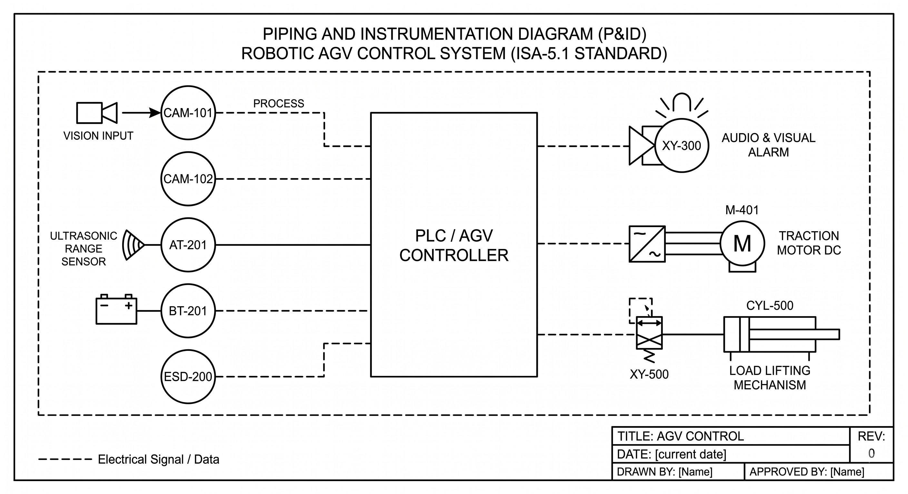

# Diagrama de Arquitetura Lógica e Intertravamento (P&ID)

Este documento apresenta o Diagrama de Tubulação e Instrumentação (**P&ID - Piping and Instrumentation Diagram**) do sistema de controle do **AGV Logístico de Inspeção e Amostragem**, elaborado segundo as normas da **ISA-5.1**.

O diagrama especifica a arquitetura de malha aberta e fechada, mapeando a integração entre os **algoritmos de Visão Computacional**, os **sensores ambientais de bordo**, o **CLP embarcado (motor lógico do SCADA-Core)** e os **atuadores físicos**.

---

## 📐 Diagrama P&ID do Sistema (Setor 300)

---

## 🛠️ Descrição dos Instrumentos e Malhas de Controle

### 1. Sensores e Entradas de Dados (Lado Esquerdo)
* **CAM-101 (Câmera Frontal RGB - Processamento de IA):** Transmite o sinal lógico $c_1$ confirmando a presença do operador no campo de visão (confiança $> 50\%$).
* **CAM-102 (Medidor de Área de Bounding Box):** Transmite o sinal discreto $d_1$ referente à proximidade crítica do operador em relação ao chassi do AGV (zona de risco de colisão).
* **AT-201 (Transmissor/Detector de Gás Tóxico):** Transmite o sinal $g_1$ ao detectar concentração de $\text{NH}_3 > 25\text{ ppm}$ no ambiente.
* **BT-201 (Transmissor de Tensão de Bateria):** Transmite o sinal $b_1$ indicando nível de carga crítica ($< 10\%$).
* **ESD-200 (Botão de Parada de Emergência):** Transmite o sinal $s_1$ de interrupção manual de emergência (NC/NF).

### 2. Processamento e Intertravamento (Centro - CLP Embarcado)
O **CLP Embarcado** recebe todos os sinais analógicos e discretos e executa o processamento do **SCADA-Core**:
* **Equação de Falha Crítica ($F$):** $F \equiv s_1 \lor b_1 \lor g_1$. Caso $F = 1$, o CLP aciona imediatamente o desligamento geral de tração e ativa a sinalização de alerta.
* **Equação de Permissivo de Movimento ($P_{mov}$):** $P_{mov} \equiv c_1 \land \neg d_1 \land \neg F$. A tração só é mantida sob ausência total de falhas e confirmação da posição do operador.

### 3. Atuadores e Saídas de Controle (Lado Direito)
* **ALM-301 (Giroflex e Buzzer de Alerta):** Recebe o comando $l_1$ em caso de disparo da malha de emergência.
* **M-301 (Motor DC de Tração Principal):** Controlado pelo sinal proporcional de velocidade e travado no caso de liberação do permissivo $m_1$.
* **A-301 (Atuador Linear do Braço Robótico):** Responsável pelo acoplamento nos tanques. Possui intertravamento físico/lógico direto com a tração: só é liberado ($a_1$) quando o motor de tração estiver parado ($\neg m_1$).